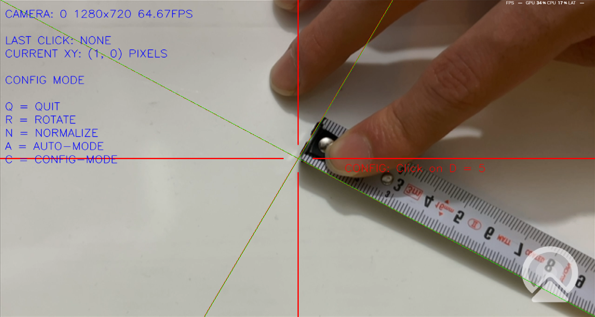

# Tracking Object via OpenCV
## Tracking Objects with opencv python and measuring Width, Height, Area of them.

## 1- Install all requirements:

    pip install -r requirements.txt

## 2- Run Project by using this command:

    python run.py

## 3- By pressing "c" process will move to calibration setting.

## 4- Use a ruler for calculate the maximum length of our view. Like this Image:

.Now close the program and remind the maximum length of your case (for mine was something about 95mm)

.Then go to camruler.py and change the "cal_range" value to maximum length (also mine is 95)

. Re run the program again
## 5- press "c" to calibrate the values like before but after that press mouse-left-click to going calibration process:
.Then press each 5 mm of ruler to calibrate our view.
## 6- After calibration process you can run AUTO-MODE by pressing "A". Here is the video for showing how auto mode and playing with Threshold works:
#### To change Threshold values you can press "T" in AUTO-MODE, then the value will be change with your mouse moving event, also for apply the changes you need to press "mouse-left-click", for ignore setting needs to press "mouse-right-click".

### NOTE: the background and distance of camera must be static and stabled. For better response use lights to remove shadow of the objects.
### Database: on camruler_config.csv the options and data will be saved.